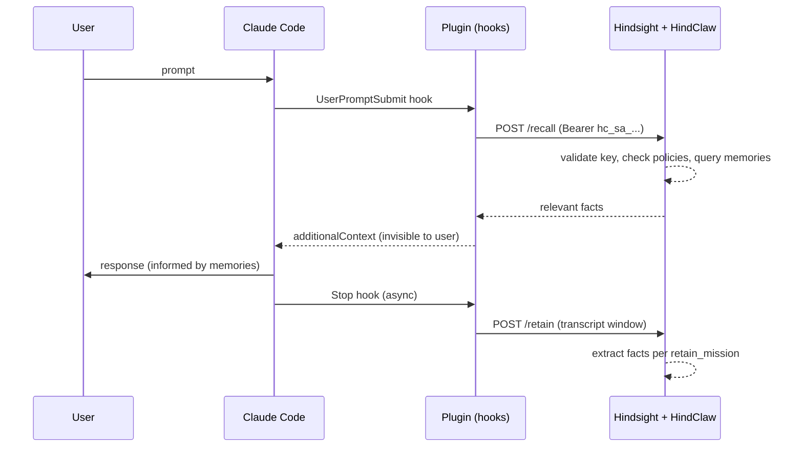

# hindclaw-claude-plugin

Long-term memory for [Claude Code](https://docs.anthropic.com/en/docs/claude-code) via [Hindsight](https://hindsight.vectorize.io) with [HindClaw](https://hindclaw.pro) server-side access control.


---

## How It Works



Four hooks intercept the Claude Code session lifecycle:

| Hook | Event | Mode | What it does |
|------|-------|------|--------------|
| `session_start.py` | SessionStart | sync, 5s | Health check, init state |
| `recall.py` | UserPromptSubmit | sync, 12s | Fetch memories, inject as context |
| `retain.py` | Stop | async, 15s | Store transcript window for fact extraction |
| `session_end.py` | SessionEnd | sync, 10s | Clean up state file |

The plugin is a thin API client. All access control, permission evaluation, tag injection, strategy routing, and fact extraction happen server-side in the [HindClaw extension](https://pypi.org/project/hindclaw-extension/).

---

## Requirements

- Python 3.11+ (stdlib only, zero external dependencies)
- Hindsight server with [hindclaw-extension](https://pypi.org/project/hindclaw-extension/) installed
- API key (service account or user key) created via `hindclaw` CLI

---

## Installation

```bash
claude plugin marketplace add mrkhachaturov/ccode-personal-plugins
claude plugin install hindclaw-claude-plugin
```

---

## Setup

### 1. Create a service account

Users create their own service accounts and scope them to limit what the plugin can do. The SA can never exceed its owner's permissions.

```bash
hindclaw sa create claude-myproject
hindclaw sa keys create claude-myproject
# Output: hc_sa_claude-myproject_aBcDeFgH...
```

### 2. Configure the plugin

**Global defaults** (`~/.claude/hindclaw.json`):

```json
{
    "hindsightApiUrl": "http://hindsight.office:8888",
    "apiKey": "hc_sa_claude-myproject_aBcDeFgH..."
}
```

**Per-project overrides** (`.claude/hindclaw.json` in the project root):

```json
{
    "bankId": "myteam::myproject",
    "template": "fullstack-dev",
    "retainEveryNTurns": 5
}
```

**Environment variables** (override everything):

| Variable | Maps to |
|----------|---------|
| `HINDCLAW_API_URL` | `hindsightApiUrl` |
| `HINDCLAW_API_KEY` | `apiKey` |

### 3. Start Claude Code

That's it. The plugin activates automatically. Open a Claude Code session and memory starts working.

---

## Configuration

### Layer priority (higher wins)

```
env vars  >  project config  >  user config  >  plugin defaults
```

### Required

| Key | Type | Description |
|-----|------|-------------|
| `hindsightApiUrl` | string | Hindsight server URL |
| `apiKey` | string | SA key (`hc_sa_*`) or user key (`hc_u_*`) |
| `bankId` | string | Target memory bank ID |

### Recall

| Key | Type | Default | Description |
|-----|------|---------|-------------|
| `autoRecall` | bool | `true` | Enable automatic recall |
| `recallBudget` | string | `"mid"` | Retrieval depth: `low`, `mid`, `high` |
| `recallMaxTokens` | int | `1024` | Max tokens for recalled memories |
| `recallContextTurns` | int | `1` | Prior user turns in recall query |
| `recallMaxQueryChars` | int | `800` | Max query length |
| `recallTopK` | int | `null` | Hard cap on returned memories |

### Retain

| Key | Type | Default | Description |
|-----|------|---------|-------------|
| `autoRetain` | bool | `true` | Enable automatic retain |
| `retainEveryNTurns` | int | `10` | Retain every Nth turn |
| `retainOverlapTurns` | int | `2` | Overlap turns for context continuity |
| `retainRoles` | list | `["user", "assistant"]` | Roles included in transcript |
| `retainContext` | string | `"claude-code"` | Context label for retained items |

### Other

| Key | Type | Default | Description |
|-----|------|---------|-------------|
| `template` | string | `null` | Template name for auto-creating the bank |
| `debug` | bool | `false` | Debug logging to stderr |

> [!NOTE]
> Retain strategy, retain tags, recall tag groups, and budget/token limits can be controlled server-side via policies. The server caps client values when they exceed the SA's policy limits.

---

## Bank Creation from Template

If the configured bank doesn't exist yet, the plugin creates it from a template on first retain.

```json
{
    "bankId": "myteam::new-project",
    "template": "backend-dev"
}
```

The template defines the bank's retain mission, entity labels, mental model seeds, and other config. Templates are managed server-side (Terraform, CLI, or API). The plugin just sends the template name; the server does the rest.

The bank is created once. If another session already created it (409), the plugin treats it as success and continues.

---

## Error Handling

Errors are surfaced through two Claude Code feedback channels:

| Channel | Who sees it | Used for |
|---------|-------------|----------|
| `systemMessage` | User (terminal) | Config errors, auth failures, bank not found |
| `additionalContext` | Claude (context) | Auth failures (so Claude can inform the user) |

Fatal errors (401, 403, missing config, server unreachable) notify once and mark the session unhealthy. All subsequent hooks skip silently. Budget/token cap warnings appear once when the server caps a value.

Hooks always exit 0. Memory failure never blocks the user's session.

---

## Repository Structure

```
hindclaw-claude-plugin/
├── .claude-plugin/
│   └── plugin.json          # Plugin manifest (name, version, author)
├── hooks/
│   └── hooks.json           # Hook event definitions
├── scripts/
│   ├── session_start.py     # SessionStart — health check, init state
│   ├── recall.py            # UserPromptSubmit — fetch and inject memories
│   ├── retain.py            # Stop — store transcript, bank creation
│   ├── session_end.py       # SessionEnd — cleanup state
│   └── lib/
│       ├── client.py        # HindclawClient(api_url, api_key)
│       ├── config.py        # 3-layer config + env overrides
│       ├── state.py         # Per-session state (fcntl-locked)
│       └── content.py       # Transcript processing, memory formatting
├── tests/                   # 189 tests (pytest, pure stdlib)
├── settings.json            # Plugin defaults
├── CHANGELOG.md
├── CLAUDE.md
├── LICENSE
└── README.md
```

---

## Testing

```bash
/usr/bin/python3.12 -m pytest tests/ -v
```

189 tests covering client, config, state, content processing, and end-to-end hook integration. Zero external dependencies.

---

## License

[MIT](LICENSE)
